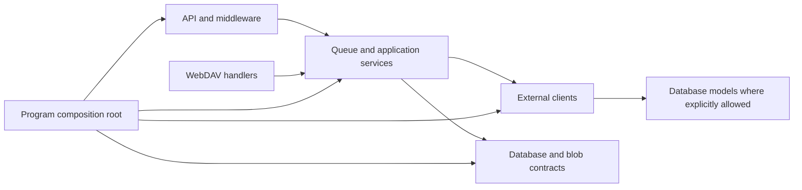

# Contributing

## Set up your system

The project consists of two sub projects: frontend and backend
Both share some necessary environment variables.

**Ensure that frontend and backend share the same environment configuration!**

Environment variables:

```bash
export CONFIG_PATH=/where/to/create/database/
export FRONTEND_BACKEND_API_KEY=$(head -c 32 /dev/urandom | hexdump -ve '1/1 "%.2x"')
export BACKEND_URL=http://localhost:5000
mkdir -p "$CONFIG_PATH"
```

The backend fails startup if `CONFIG_PATH` is missing, is a regular file, or is not writable. Create the directory yourself (or use `./scripts/run-backend.sh`, which does).

### PostgreSQL main database

SQLite is the default. To develop against an external PostgreSQL main database,
start PostgreSQL separately and add:

```bash
export DATABASE_PROVIDER=postgres
export DATABASE_CONNECTION_STRING='Host=localhost;Port=5432;Database=infinidysk;Username=infinidysk;Password=infinidysk'
```

This applies only to a fresh main database; metrics and the other auxiliary
stores remain under `CONFIG_PATH`.

PostgreSQL migrations live in `backend/Database/PostgresMigrations/` and target
`PostgresDavDatabaseContext`. Generating a new one requires both environment
variables to be set (the design-time factory validates them):

```bash
cd backend
DATABASE_PROVIDER=postgres \
DATABASE_CONNECTION_STRING='Host=localhost;Port=5432;Database=infinidysk;Username=infinidysk;Password=infinidysk' \
dotnet ef migrations add Descriptive-Name --context PostgresDavDatabaseContext
```

The backend thread-pool limits can optionally be overridden with
`THREADPOOL_MIN_THREADS` and `THREADPOOL_MAX_THREADS`. When unset, they retain
the production defaults of `max(2 × processor count, 50)` minimum threads and
`max(50 × processor count, 1000)` maximum threads.

You need some packages in order to run the project:

- dotnet-sdk
- aspnet-runtime
- nodejs
- npm
- cmake and ninja (to build the rapidyenc native library from the submodule)

Example installation for Arch based systems:

```bash
sudo pacman -S dotnet-sdk aspnet-runtime nodejs npm cmake ninja
```

On macOS (Homebrew):

```bash
brew install --cask dotnet-sdk
brew install node cmake ninja
```

After cloning, initialize the rapidyenc submodule:

```bash
git submodule update --init libs/rapidyenc
```

## Preferred local workflow

Use the helper scripts so the frontend and backend share env automatically:

```bash
# Terminal 1 — backend (builds rapidyenc if needed, migrates, writes frontend/.env)
./scripts/run-backend.sh

# Terminal 2 — frontend (`predev` runs scripts/sync-dev-env.sh)
cd frontend && npm install && npm run dev
```

`npm run dev` silently runs `scripts/sync-dev-env.sh` via the `predev` hook; if the API key drifts, restart the backend with `scripts/run-backend.sh`. The manual `dotnet publish` / env-var flow below remains supported.

`scripts/run-backend.sh` defaults `LOG_LEVEL=Debug` (and `LOG_BUFFER_SIZE=2000`) when unset so local playback debugging is verbose. Docker/production leave these unset and keep Information-level logging. It also enables the contributor-only admin API reference locally; sign in through the frontend and open `http://localhost:5173/scalar/`. The backend's `/openapi/admin.json` endpoint requires `x-api-key` when accessed directly. Set `ENABLE_API_DOCS=false` to disable it; released Docker images keep it disabled unless explicitly enabled.

The committed admin OpenAPI contract lives at `contracts/openapi/admin-v1.json` (versioned independently of the product release). After adding or changing an admin endpoint used by the frontend, refresh it and regenerate TypeScript types:

```bash
./scripts/export-admin-openapi.sh
cd frontend && npm run generate:api
```

The export command starts the test host, normalizes the document (stable key order, empty `servers`, contract version `1.0.0`), and fails if the result does not match the committed file unless you are rewriting it. Frontend `lint` / `typecheck` / `test` / `build` regenerate `app/generated/admin-api.ts` automatically (gitignored).

Stream tracing is **opt-in** and off by default. Toggle it from **Settings → Support** for 15/30/60 minutes (no restart; it auto-expires and never survives a restart), or set `STREAM_TRACE_EVENTS` to a positive value for an always-on capture from startup. When tracing is off, no trace events are recorded and the trace APIs report `enabled: false`.

`scripts/run-backend.sh` builds the host rapidyenc native (via `scripts/build-rapidyenc.sh`) when missing and exports `RAPIDYENC_LIBRARY_PATH`. With that in place, yEnc-decoding tests run on macOS and Linux; without a native library they are skipped.

## Real-provider playback testing

Use the two-process workflow above with a real Usenet provider (credentials stay in SQLite under `CONFIG_PATH`; never commit them).

1. Start backend + frontend (`./scripts/run-backend.sh`, then `cd frontend && npm run dev`).
2. Open `http://localhost:5173` → create the admin account if needed.
3. **Settings → Usenet** — add your provider (host, port, SSL, credentials, connections). Use Test connection / Benchmark if desired.
4. **Settings → WebDAV** — set a WebDAV username/password (required for rclone and most players).
5. Drop an `.nzb` on the Queue page and wait for it to mount.
6. Play via Explore / `/view/...`, or point rclone/VLC at the **frontend** proxy (`http://localhost:5173`), not the backend port directly.

Ports: UI `5173` → proxies WebDAV + `/api` → backend `5000`.

### Dumping a stream trace

While a file is playing, Overview → **Right now** shows a truncated session id (click to copy). After seeking/scrubbing:

```bash
# Latest active/recent session (or pass an explicit session id)
./scripts/dump-stream-trace.sh
./scripts/dump-stream-trace.sh <session-id>
```

Writes JSON under `swap/` (gitignored), including the correlated range/seek/segment/zero-fill timeline and a recent logs snapshot. Drop that file into chat for analysis. Traces are in-memory only — dump before restarting the backend.

## Build / run backend

UsenetSharp, RapidYencSharp, and SharpCompress live under `libs/` and are
referenced as project references. Prefer `./scripts/run-backend.sh`, which
initializes the host rapidyenc native and env for you. Manual flow:

```bash
git submodule update --init libs/rapidyenc
./scripts/build-rapidyenc.sh   # host RID (osx-arm64, linux-x64, …)
# Point RAPIDYENC_LIBRARY_PATH at the built dylib/so under
# libs/RapidYencSharp/runtimes/<rid>/native/ (run-backend.sh does this).

cd backend

# Build (release)
dotnet publish -c Release -o ./publish

# Create database
mkdir -p $CONFIG_PATH
./publish/NzbWebDAV --db-migration

# Run backend
./publish/NzbWebDAV
```


## Build / serve frontend

Requires **Node.js 24+** (see `engines` in `frontend/package.json`).

`package.json` includes an `overrides` entry that pins `http-proxy-middleware` to the `http-proxy-node16` fork for Node compatibility. Remove it only after verifying proxy behavior against upstream `http-proxy`.

```bash
cd frontend

# Install dependencies
npm install

# Run / serve frontend with hot module replacement
npm run dev
```

## Build Docker image

### Using Docker CLI

```bash
docker build .
```

You can also tag the release, which can be used with `docker compose`:

```bash
docker build -t example/infinidysk:test_build .
```

Run the container:

```bash
docker run --rm -it \
  -v /path/to/infinidysk/config:/config \
  -e PUID=1000 \
  -e PGID=1000 \
  -p 3333:3000 \
  example/infinidysk:test_build
```

### Using Docker Compose

```yaml
services:
  infinidysk:
    build: .
    ports:
      - 3333:3000
    volumes:
      - /path/to/infinidysk/config:/config
      - /path/to/infinidysk/data:/data
    environment:
      - PUID=1000
      - PGID=1000
```

Build and run container:

```bash
docker compose up
```

## NuGet packages

This repo uses [NuGet Central Package Management](https://learn.microsoft.com/en-us/nuget/consume-packages/central-package-management). Package versions live in the root `Directory.Packages.props`. Project files list `<PackageReference Include="..." />` without a `Version` attribute (asset metadata such as `PrivateAssets` still belongs on the project reference).

To add a package:

1. Add `<PackageVersion Include="The.Package" Version="x.y.z" />` to `Directory.Packages.props` if that package is not already listed.
2. Add `<PackageReference Include="The.Package" />` to each project that needs it.

To bump a version, change only `Directory.Packages.props`. Dependabot updates that file (the `nuget` ecosystem is rooted at `/`).

Restore uses the repo-root `nuget.config`, which pins [nuget.org](https://www.nuget.org/) as the only package source. Central package management requires a single source or [package source mapping](https://learn.microsoft.com/en-us/nuget/consume-packages/package-source-mapping); do not add extra sources without mapping them.

## Static analysis policy

All first-party C# projects build with the full .NET analyzer set
(`AnalysisLevel=latest-All` via the pinned `Microsoft.CodeAnalysis.NetAnalyzers`
package in the root `Directory.Build.props`). New code must not introduce
analyzer or compiler warnings.

When a rule fires, resolve it in this order:

1. **Fix it.** Most rules catch real issues (disposal, async, culture) or have
   a mechanical code fix.
2. **Per-site suppression** — `#pragma warning disable` (or a targeted
   `GlobalSuppressions.cs` entry) with a justification comment — when the rule
   misfires on intent at a specific place. Typical legit cases: ownership
   transfers the analyzer cannot see (e.g. CA2000/CA2025 around background
   tasks or response-lifetime disposal via `Response.OnCompleted`),
   format-mandated weak hashes (CA5351), user-facing opt-outs
   (CA5359/CA5398), and classification sites that must not bind the ambient
   cancellation token (CA2016).
3. **Rule-level policy** in the root `.editorconfig` (`tests/.editorconfig`
   for test-only noise) with a written justification — only for rules that are
   structural for this codebase (e.g. CA1515 "make types internal" in an
   ASP.NET app, xUnit naming conventions in tests).

Rules that must **never** be disabled rule-wide: the security rules (CA53xx) —
use per-site justification suppressions so each instance stays auditable.
`CA2016` (forward CancellationToken) and `CA1001` (types that own disposables
implement IDisposable) are listed explicitly in `Directory.Build.props`
`<WarningsAsErrors>` so they stay errors even if the blanket gate is narrowed.

Hosted services must honor `stoppingToken`. The generic host `ShutdownTimeout`
is 5 seconds (see `backend/Program.cs`).

Notes:

- `libs/UsenetSharp` and `libs/RapidYencSharp` have their own `root = true`
  `.editorconfig` files with a mirrored policy block — keep them in sync with
  the root policy.
- `libs/SharpCompress` and `tests/SharpCompress.Tests` are vendored upstream
  code and exempt via per-project `<NoWarn>` (justification in the csproj).
  Do not fix analyzer warnings in them; keep ports clean instead.
- Bulk `dotnet format analyzers` runs: temporarily remove the analyzer package
  from `Directory.Build.props` first — with the package referenced, the format
  workspace loads both the SDK and packaged analyzer copies and applies every
  code fix twice. Restore the package afterwards (builds are unaffected either
  way; only the format tool is).

## Architecture boundaries

Inbound adapters (API, WebDAV HTTP, middleware) call Queue and other application
services. Those services talk to external clients and the database. `Program` is
the composition root. `Services` is currently mixed — do not treat it as one
clean layer. Details and exceptions: [Code boundaries](docs/decisions/0001-code-boundaries.md).



Frontend route features may use shared `app/components`, `app/navigation`,
`app/clients`, `app/auth`, and `app/utils`, plus files inside the same feature.
They must not import another route feature. Shared code must not import
`app/routes`. ArchUnitNET (`tests/NzbWebDAV.ArchitectureTests`) and the
`import-boundaries/no-cross-feature-imports` ESLint rule enforce this.

## Contributing

Before creating a PR, run the checks that correspond to the required CI jobs:

```bash
# Frontend job
cd frontend
npm run lint
npm run format:check
npm run typecheck
npm run build
npm test
npm run test:coverage
cd ..

# Backend job (from repository root; build rapidyenc first when tests load natives)
python3 scripts/check-quality-ratchets.py \
  --package-json frontend/package.json \
  --thresholds frontend/coverage-thresholds.json \
  --summary frontend/coverage/coverage-summary.json \
  --exceptions quality/ratchet-exceptions.json
bash scripts/test-quality-ratchets.sh
dotnet format whitespace --verify-no-changes --folder backend
dotnet format whitespace --verify-no-changes --folder backend.Benchmarks
dotnet format whitespace --verify-no-changes --folder tests/NzbWebDAV.Tests
dotnet format whitespace --verify-no-changes --folder tests/UsenetSharp.Tests
dotnet format whitespace --verify-no-changes --folder tests/RapidYencSharp.Tests
dotnet format whitespace --verify-no-changes --folder libs/UsenetSharp
dotnet format whitespace --verify-no-changes --folder libs/RapidYencSharp
dotnet test tests/NzbWebDAV.Tests/NzbWebDAV.Tests.csproj -c Release
dotnet test tests/NzbWebDAV.ArchitectureTests/NzbWebDAV.ArchitectureTests.csproj -c Debug
```

Vendored SharpCompress sources and tests are not part of the format gate.

### Required status checks

Branch protection on `main` should require this **one aggregate CI check**, plus
the independent documentation and CodeQL workflows:

| Check name | Workflow |
| --- | --- |
| `CI / Required quality gate` | `.github/workflows/ci.yml` |
| `Documentation / build` | `.github/workflows/docs.yml` |
| `CodeQL / Analyze (actions)` | `.github/workflows/codeql.yml` |
| `CodeQL / Analyze (csharp)` | `.github/workflows/codeql.yml` |
| `CodeQL / Analyze (javascript-typescript)` | `.github/workflows/codeql.yml` |

`CI / Required quality gate` succeeds only when `frontend`, `backend`,
`postgres-migrations`, `macos-yenc`, `alpine-yenc`, `quality-ratchets`, and
`contracts` succeed. `docker-runtime-smoke` may be skipped when the runtime image inputs
did not change, or on pushes to `main`. Coverage-upload jobs are not required
(forks omit those artifacts).

Configuring those names as required checks is a repository-admin action. Enable
it after `CI / Required quality gate` has succeeded at least once on `main`.
Also require the branch to be up to date, at least one approval, a code-owner
review, stale-approval dismissal, conversation resolution, and no force-push or
branch deletion. Limit bypass to designated maintainers.

### Quality ratchets

- **Coverage floors** live in `frontend/coverage-thresholds.json`. They cannot
  decrease unless `quality/ratchet-exceptions.json` contains a complete,
  unexpired exception (`scope`, `metric`, `oldValue`, `newValue`, `issueUrl`,
  `reason`, `expiresOn`). Expired or malformed entries fail CI. When actual
  coverage is at least 5 percentage points above a floor, raise the floor to
  `floor(actual) - 2`.
- **ESLint `--max-warnings`** in `frontend/package.json` can only decrease.
  There is no exception path.
- **NuGet high/critical** findings fail CI unless listed in
  `scripts/nuget-vulnerability-allowlist.json` with `packageId`, `advisoryUrl`,
  `reason`, and `expiresOn`. Expired allowlist rows are ignored and the finding
  fails.
- **Mutation baselines** (when present under `quality/`) follow the same
  decrease rule as coverage floors.

Do not commit generated coverage directories, mutation HTML, Stryker
incremental state, `frontend/build/`, `frontend/dist-node/`, or local
databases.
