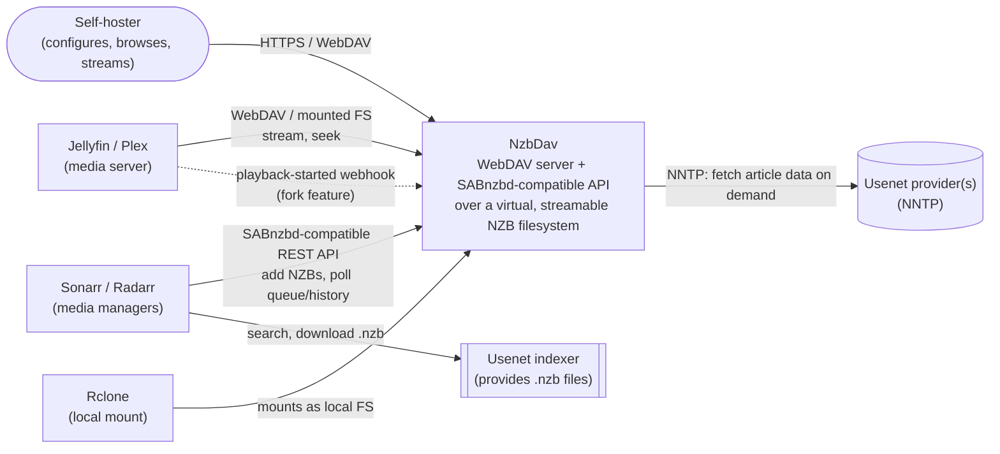

# 3. Context and Scope

## 3.1 Business context

| External party | Relationship |
|---|---|
| **Sonarr / Radarr** | Treat NzbDav as a SABnzbd download client: add NZB, poll `queue`/`history`, read `status`/`categories`. This is a one-directional, contract-frozen integration (see §2) — NzbDav must look exactly like SABnzbd from their point of view. |
| **Usenet indexer(s)** | Not contacted directly by NzbDav; Sonarr/Radarr (or a user) supply `.nzb` files or URLs to fetch them from. |
| **Usenet provider(s)** | One or more configured NNTP backends. NzbDav is the client; providers are opaque, rate-limited, occasionally-unreliable external services — failover and circuit-breaking exist specifically because this relationship cannot be assumed reliable. |
| **Jellyfin / Plex (or any WebDAV/Rclone-capable media server)** | Consume the virtual filesystem as their media library, issuing ranged HTTP reads for seeking. The Jellyfin webhook integration (fork-specific, see §9) additionally lets NzbDav *anticipate* what will be watched next. |
| **Rclone** | Optional intermediary that remounts the WebDAV filesystem as a native local mount, for tools that can't speak WebDAV directly. |
| **End user (browser)** | Uses the React Router frontend for configuration, queue/history visibility, and ad hoc filesystem exploration (`/explore`). |

## 3.2 Technical context

| Interface | Protocol | Direction | Notes |
|---|---|---|---|
| WebDAV filesystem | HTTP(S), WebDAV verbs (PROPFIND, GET/HEAD with Range, OPTIONS) | Inbound | Served by `NWebDav.Server`, backed by `WebDav/DatabaseStore.cs` against SQLite, not a real filesystem. Range/seek support is the system's core latency-sensitive path (see §6, §10 QS-1). |
| SABnzbd-compatible REST API | HTTP, JSON, SABnzbd's query-param/mode-based API shape | Inbound | `Api/SabControllers/*`; consumed by Sonarr/Radarr as if this were SABnzbd. |
| App-facing REST API | HTTP, JSON, `x-api-key` auth | Inbound | `Api/Controllers/*`; consumed by the frontend server (proxied) for auth, config, health, connection tests, WebDAV browsing. |
| NNTP | NNTP over TCP(+TLS) | Outbound | `Clients/Usenet/NntpClient` talks to one or more configured Usenet providers to fetch article data on demand — never bulk-downloads to local disk. |
| Websocket | WS, JSON messages | Inbound (browser) / internal | Live queue/health updates and (fork-specific) provider usage stats pushed from backend to frontend to browser. |
| Jellyfin webhook | HTTP, JSON | Inbound | Fork-specific: Jellyfin posts playback-started events, consumed to drive predictive episode-prefetch caching. |
| Frontend↔Backend proxy | HTTP, internal to the container | Internal | Express (`frontend/server.ts`) proxies `/api`, `/view`, `/.ids`, `/nzbs`, `/content`, `/completed-symlinks`, and WebDAV verbs straight to `$BACKEND_URL`, injecting `FRONTEND_BACKEND_API_KEY`. |

## 3.3 Scope of this document

In scope: everything under `backend/` and `frontend/`, the root `Dockerfile`/`entrypoint.sh`, and
`.github/workflows/` insofar as they affect the deployed artifact. Out of scope: the internals of
Sonarr/Radarr, Jellyfin/Plex, Rclone, or any specific Usenet provider — these are treated as black
boxes with a defined interface, per the table above.
