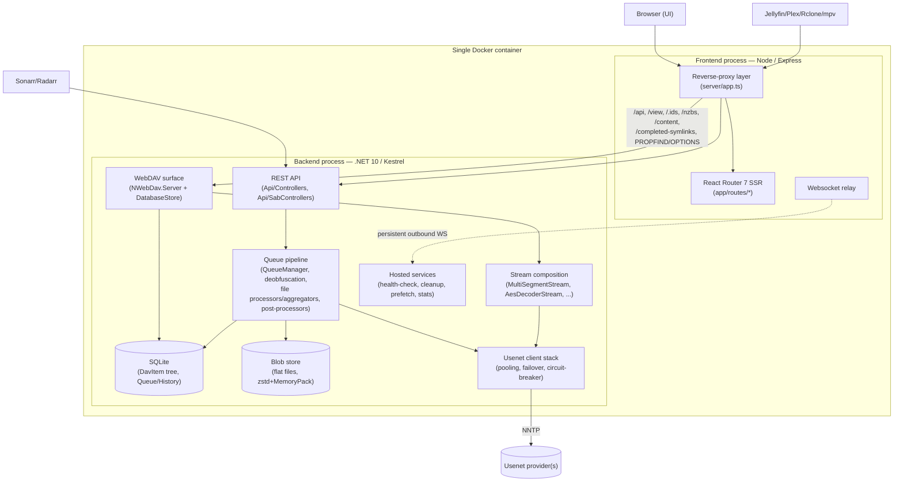

# 5. Building Block View

This section synthesizes the five parallel research passes (`_research/*.md`) into the whitebox
structure of the system. All `file:line` citations are as found by those passes; see the underlying
research files for the full trace if a citation needs re-verification.

## 5.1 Level 1 — Whitebox overall system



## 5.2 Backend building blocks

### 5.2.1 Queue pipeline (`backend/Queue/`) — INHERITED, ~96%+

`QueueManager` (`backend/Queue/QueueManager.cs:12,78`) is a singleton started from its own
constructor (not an `IHostedService`), running a strictly **serial**, one-item-at-a-time loop:
pull the highest-priority/oldest non-paused `QueueItem` → scope one `ArticleCachingNntpClient` to
it → run `QueueItemProcessor.ProcessAsync` to completion → repeat. A `SemaphoreSlim(1,1)` guards
safe cancellation of the in-flight item on user-initiated removal.

`QueueItemProcessor` (`backend/Queue/QueueItemProcessor.cs:24`) orchestrates, per item:

1. Duplicate-nzb check → streaming `NzbDocument.LoadAsync` (XML `XmlReader`, no DOM) → archive
   password resolution.
2. **Deobfuscation** (`backend/Queue/DeobfuscationSteps/1..3`): fetch only the *first article* of
   every file (16KB, bounded concurrency) → find the smallest PAR2-magic-byte file among them and
   download only that (small) file → reconcile filenames across PAR2/NZB-subject/yEnc-header
   sources with a priority+size-tolerance heuristic. This lets nearly all naming/identification work
   happen on a tiny fraction of the release's total bytes — the key lever behind QS-2.
3. **File processing** (`backend/Queue/FileProcessors/`), grouped by container type and run with
   *bounded concurrency = `GetMaxDownloadConnections() + 5`* — i.e. parallelism happens **within**
   one queue item, never **across** items:
   - `RarProcessor` — live-streams RAR headers via SharpCompress, emits byte ranges inside the
     still-undownloaded archive.
   - `SevenZipProcessor` — only uncompressed (store-mode) 7z is supported; compressed/solid+encrypted
     7z is a hard, non-retryable rejection.
   - `MultipartMkvProcessor` — plain sequential-part concatenation, no container/compression.
   - `FileProcessor` — the fallback; silently drops non-video files on a missing article, fails on a
     missing video file.
4. Optional full article-existence check (`ensure_article_existence`, opt-in per category).
5. **Aggregation + post-processing**, inside one `MarkQueueItemCompleted` closure — the actual DB
   write boundary: `RarAggregator`/`FileAggregator`/`SevenZipAggregator`/`MultipartMkvAggregator`
   build `DavItem` + blob rows, then `RenameDuplicatesPostProcessor` →
   `SampleFilePostProcessor` (opt-in) → `BlocklistedFilePostProcessor` →
   `EnsureImportableVideoValidator` (opt-in) → `CreateStrmFilesPostProcessor` (opt-in, the only
   step touching the *real* filesystem).

Retry/failure is three-way: cancellation (no DB write at all), retryable download exception
(`PauseUntil = now + 1min`, requeued, **no observed retry cap**), or any other exception (moved to
`HistoryItems` as `Failed`).

### 5.2.2 Virtual filesystem & persistence (`backend/Database/`) — INHERITED

`DavItem` (`DavItem.cs:6`) is the single tree-node type (directories and files alike),
discriminated by `Type`/`SubType`, with a **denormalized materialized `Path`** for O(1) reads at
the cost of needing cascade-updates on directory rename (unverified in this pass — see §11.5, OQ-1).

**The most consequential finding of this whole document**: per-segment file metadata is *not*
stored as SQLite JSON columns despite `DavNzbFile`/`DavRarFile`/`DavMultipartFile` having full EF
Core configs for exactly that. Every write instead goes through `BlobStore.WriteBlob<T>`
(`BlobStore.cs:12-19`) — zstd-compressed, MemoryPack-serialized flat files under
`CONFIG_PATH/blobs/<guid[0:2]>/<guid[2:4]>/<guid>` — with only a GUID pointer kept in SQLite. The
SQLite JSON tables are legacy read-fallback only, actively drained on every startup by
`UsenetFileToBlobstoreMigrationService`. This is a completed, deliberate migration (dated
2026-01-19) away from "large JSON blobs as SQLite row values" — almost certainly to keep the SQLite
file and its WAL small regardless of how many segments a release has (a multi-GB remux can exceed
5,000 segments).

`QueueItem`/`HistoryItem` are SABnzbd-shaped queue/history rows; `QueueNzbContents` follows the same
blob-store-primary/SQLite-fallback pattern for the raw NZB XML itself.

### 5.2.3 PAR2 parsing (`backend/Par2Recovery/`) — INHERITED

Despite the folder name, **there is no repair/reconstruction capability** — only packet-header
framing and `FileDesc` (filename/size/hash) packet parsing, consumed solely for deobfuscation.
Missing/damaged articles can only be detected, never reconstructed from PAR2 redundancy.

### 5.2.4 WebDAV layer (`backend/WebDav/`) — INHERITED

`DatabaseStore` → `DatabaseStoreCollection` resolves every WebDAV path as a **live,
segment-by-segment SQLite query chain** (no in-memory directory-tree cache). `DavFileStreamFactory`
(`DavFileStreamFactory.cs:13`) is the single place that turns a `DavItem` + blob metadata into a
live decoded `Stream` — explicitly shared between the WebDAV read path and the fork's prefetch-cache
warmer. `GetAndHeadHandlerPatch` replaces NWebDav's stock GET/HEAD handler and computes
range/seek behavior purely via `Stream.Seek` on the composed stream chain — this is the mechanism
that makes sub-2s seeks (QS-1) achievable at all, addressed in detail in §6.2.

`BaseStoreStreamFile.GetReadableStreamAsync` (`Base/BaseStoreStreamFile.cs:16`) first checks a
**local prefetch-cache file** (FORK-SPECIFIC, Jellyfin-webhook predictive prefetch) and serves a
plain `FileStream` on a hit, bypassing Usenet entirely; on a miss it tags the request
`DownloadPriorityContext{High}` before descending into the Usenet stack.

### 5.2.5 Usenet client stack (`backend/Clients/Usenet/`) — mostly INHERITED

**Correction to the project's own framing**: raw NNTP protocol and yEnc decode are *not*
hand-rolled — they're delegated to `UsenetSharp` (external NuGet, same `nzbdav-dev` org), which
itself depends on `RapidYencSharp`, a P/Invoke binding to the native, SIMD-accelerated `rapidyenc` C
library. Only the layering above that is this repo's own code:

```
UsenetStreamingClient          (singleton; hot-swaps stack on config change)
  -> DownloadingNntpClient     (global download-concurrency + bandwidth throttling)
    -> MultiProviderNntpClient (failover across configured providers, circuit-breaker aware)
      -> MultiConnectionNntpClient  (one per provider: connection pool + per-command priority)
        -> ConnectionPool<INntpClient>
          -> BaseNntpClient        (thin adapter over UsenetSharp)

ArticleCachingNntpClient — separate, short-lived, used ONLY by Queue ingestion
  (QueueManager.cs:113), never by the WebDAV read/seek path.
```

`PrioritizedSemaphore` (two-queue, odds-based) gates both the per-provider connection pool (priority
= command type) and the download-concurrency budget (priority = interactive-vs-background, via an
ambient `CancellationToken`-keyed context since a background download loop runs detached from the
original async call stack). `ConnectionPool`/`ConnectionLock` are explicitly code-comment-marked as
ChatGPT-authored, with no accompanying tests (there is no backend test project in this repo at all).
`ProviderCircuitBreaker` trips after 3 consecutive failures per provider, static/hardcoded
thresholds (60s initial cooldown, doubling to a 5-minute cap).

### 5.2.6 Stream composition (`backend/Streams/`) — INHERITED, plus FORK-SPECIFIC decorators

`NzbFileStream`/`MultiSegmentStream` fetch and decode segments on demand, read-ahead via a bounded
channel; `DavMultipartFileStream`/`CombinedStream` stitch multi-part files; `AesDecoderStream`
handles password-protected archives; `SubStream`/`LimitedLengthStream` provide range composition;
`ProbingStream` sniffs content type. FORK-SPECIFIC additions follow the same "wrap the stream,
override `ReadAsync`" pattern already established upstream: `ThrottledYencStream` (bandwidth
limiting) and `ProviderCountingYencStream` (per-provider usage stats).

### 5.2.7 API & Auth (`backend/Api/`, `backend/Auth/`) — INHERITED, one FORK-SPECIFIC risk

Two REST families share one Kestrel host: `Api/Controllers/*` (UI-facing, gated by a static
`x-api-key`/`FRONTEND_BACKEND_API_KEY`) and a single `SabApiController` (SABnzbd-compatible,
`mode`-param dispatch to ~11 nested handlers, accepting either the frontend key or a separate
rotatable `api.key`). Streamed file URLs use **path-scoped SHA-256 download tokens** instead of the
raw key — sound design, lets `.strm` files/media players stream without holding the shared secret.
`DISABLE_WEBDAV_AUTH` (INHERITED — externally contributed but merged upstream, self-described
"vibe-coded" in its own commit message, see [ADR-009](adr/ADR-009-webdav-auth-bypass.md)) is a
blanket auth bypass with no compensating trusted-proxy check — see §11.

### 5.2.8 Hosted services (`backend/Services/`) — mixed

All follow the same `IHostedService`/`BackgroundService` retry-loop convention. INHERITED:
`HealthCheckService` (segment-availability re-verification + Arr-triggered repair search),
`ArrMonitoringService`, `BlobCleanupService`, `NzbBlobCleanupService`, `HistoryCleanupService`,
`DavCleanupService`, `UsenetFileToBlobstoreMigrationService`,
`RemoveOrphanedFilesSchedulerService`. FORK-SPECIFIC: `ProviderUsageStatsAggregator`,
`PrefetchCacheService` + `EpisodeResolverService` (the Jellyfin predictive-prefetch feature),
`CacheEvictionService`.

## 5.3 Frontend building blocks (`frontend/`) — INHERITED, fork touches UI only

Filesystem-routed React Router 7 SSR app (`app/routes/*` + one manual `/explore/*` catch-all). A
hand-rolled Express server (`server.ts` + `server/app.ts`) does three jobs in one process:

1. **Reverse-proxy** `PROPFIND`/`OPTIONS` and any path starting with `/api`, `/view`, `/.ids`,
   `/nzbs`, `/content`, `/completed-symlinks` straight to `$BACKEND_URL`, injecting
   `x-api-key: $FRONTEND_BACKEND_API_KEY` for authenticated browser sessions on `/api/*` only.
   Compression is deliberately excluded on all six proxied prefixes (a real regression fix, not a
   preemptive choice — compressing would strip/rewrite `Content-Length` and break range requests).
2. **Session auth** (`auth-middleware.server.ts`) for everything else — but note: the six proxied
   prefixes above return *before* this middleware runs, so streamed/API paths are **not**
   session-gated at all; they rely entirely on the backend's own `x-api-key` check (for `/api`) or
   the path-scoped `downloadKey` capability token (for the rest, e.g. `.strm` files consumed by
   external media players that can't hold a browser session).
3. **Websocket relay**: a browser-facing `WebSocketServer` (session-cookie-gated) plus a single
   persistent outbound connection to the backend's `/ws`, fanning out `{Topic, Message}` events with
   a per-topic `lastMessage` replay cache.

`backend-client.server.ts` is the typed server-side fetch wrapper used by route loaders/actions —
distinct from the proxy (which handles pass-through/streamed paths).

Fork-specific frontend work to date is exclusively feature/settings UI (prefetch settings,
bandwidth-limit split, sample-file cleanup) — **zero changes to `server.ts`, `server/app.ts`,
`websocket.server.ts`, `auth-middleware.server.ts`, or `routes.ts`**. Frontend architecture is
untouched by the fork.
