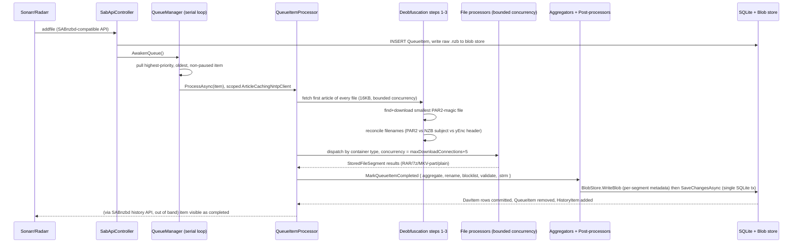
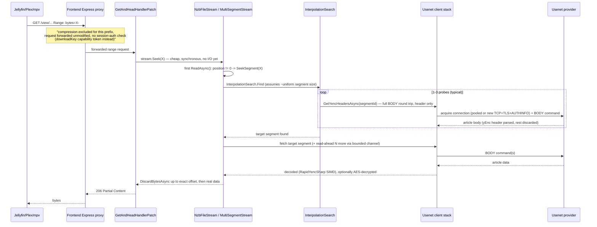

# 6. Runtime View

Per the aim42/arc42 discipline of documenting the scenarios that actually matter, this section
traces the two runtime scenarios that dominate the quality goals in §10: **ingestion** (QS-2,
QS-8) and **streaming/seek** (QS-1, QS-3, QS-6). Both cross every subsystem boundary the parallel
research agents were split along, which is why they're synthesized here directly rather than left
to any one agent's report.

## 6.1 Scenario: NZB added → visible in the virtual filesystem (QS-2, QS-8)

**Where the time goes** (per the core-domain agent's trace): app-overhead is dominated by (a) the
first-segment fetch fan-out, (b) the one small PAR2-index download, (c) bounded-concurrency file
processing — all designed to be small relative to the actual Usenet download time of the full
release. This is the concrete mechanism that makes QS-2 achievable *in principle*.

**Where QS-2 actually breaks down**: `QueueManager`'s loop is **strictly serial across items** —
a second release queued while the first is still processing does not even start downloading until
the first fully completes, including all post-processing. Bounded concurrency exists only *within*
one item (file-level parallelism), never *across* items. See §11 for the concrete optimization
candidate (bounded-parallel queue processing) and its cost.

**Crash-safety (QS-8)**: all `DavItem`/`QueueItem`/`HistoryItem` mutations for one item are batched
into a single `SaveChangesAsync` call at the very end. Blob files are written just before the SQLite
transaction and rolled back (deleted) on any exception the *current process* is alive to catch — a
hard kill between blob-write and SQLite-commit can leave orphaned blob files (a disk-space leak, not
a virtual-filesystem corruption risk) until an orphan-cleanup sweep reclaims them. Killing the
process at any earlier point simply means the whole item is retried from scratch next start — safe,
if wasteful of the partial download.

## 6.2 Scenario: ranged GET / mid-playback seek → bytes out (QS-1, QS-3, QS-6)

This is the scenario that most directly determines whether "as performant as possible" is being
met, and it crosses the frontend proxy, the WebDAV layer, and the full Usenet client stack.

**Fresh sequential start** (no seek) costs exactly one connection-acquire + one BODY round trip
before first byte — `MultiSegmentStream` spawns a detached read-ahead pipeline immediately.

**A seek is strictly slower than a fresh start**, by roughly the interpolation-probe count, because
**`ArticleCachingNntpClient` — the only caching layer in the whole Usenet stack — is scoped
exclusively to Queue ingestion and is never used on this path.** Every seek re-fetches yEnc headers
live, with zero memoization, even for repeated seeks into the same already-open file. This is the
single most concrete, actionable finding for QS-1 in this entire document (see §11, optimization
candidate: cache yEnc headers per `NzbFileStream`).

**Priority propagation**: every WebDAV read tags its `CancellationToken` with
`DownloadPriorityContext{High}` before descending into the stack, so interactive reads/seeks queue
ahead of background queue downloads (`Low` priority by default) at both the download-concurrency
semaphore and the per-provider connection-pool gate — this is the concrete mechanism behind QS-3's
"streaming shouldn't stall behind ingestion." It does **not** protect one interactive stream from
another: with no connection pre-warming, a 3rd/4th concurrent stream on a saturated provider
connection pool queues behind the others at equal priority (see §11).

**Provider failover (QS-6)** sits one layer below the fresh-start/seek distinction: any BODY/HEAD
failure is retried once on the same connection, then escalates to `MultiProviderNntpClient`, which
skips circuit-broken providers (3 consecutive failures trips a 60s-to-5min cooldown) and orders
remaining providers by configured type then available connections — invisible to the stream
consumer unless every configured provider is simultaneously down.

**The fork's predictive-prefetch cache** (`BaseStoreStreamFile.TryGetCachedStreamAsync`,
Jellyfin-webhook-driven) sits *in front of* this entire scenario: on a hit, it serves a plain local
`FileStream` and none of the above runs at all. This changes how often the cold path in this section
is even exercised for the common "next episode" case, without helping true random-scrub seeks — see
§11 for how this interacts with the yEnc-header-caching optimization candidate.
