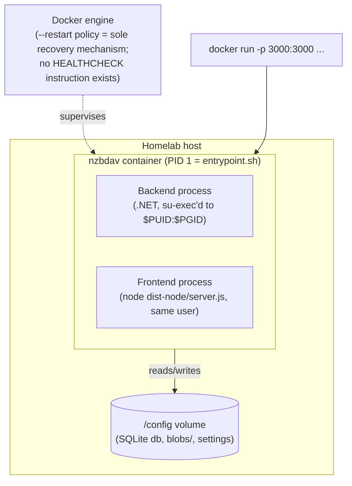

# 7. Deployment View

Deployment target (per §2): a single local Docker container on a homelab-style host. This section
is synthesized from `_research/deployment.md`.

## 7.1 Infrastructure



## 7.2 Image build (3-stage)

1. **`frontend-build`** (`node:alpine`, build-host-native platform) — `npm install` → `npm run
   build` (React Router SSR build) → `npm run build:server` (`tsc` → `dist-node/`) → `npm prune
   --omit=dev`.
2. **`backend-build`** (`dotnet/sdk:10.0-alpine`, build-host-native platform) — `dotnet restore` +
   `dotnet publish -r linux-musl-${TARGETARCH}`. Only this final publish step is
   architecture-specific; the build stages themselves run native (not QEMU-emulated) via
   buildx's `BUILDPLATFORM` pinning, so a multi-arch `docker buildx build
   --platform linux/amd64,linux/arm64` doesn't emulate the whole npm/dotnet build.
3. **Final image** (`dotnet/aspnet:10.0-alpine` — runtime, not SDK) — installs `nodejs npm
   libc6-compat shadow su-exec bash curl tzdata`, copies both runtimes' build output. `EXPOSE 3000`,
   `CMD ["/entrypoint.sh"]`.

**Both language runtimes are bundled into one final image** — the single most consequential
deployment decision in the repo. Maximizes QS-7 (one `docker run`, one volume) at a direct cost to
QS-4 (two full runtimes' worth of base footprint + `frontend/node_modules` at runtime).

No `.dockerignore` exists — doesn't affect final image size (multi-stage `COPY --from=` is
selective) but does affect local build-context transfer time.

## 7.3 Process topology and startup sequence

`entrypoint.sh` is PID 1 and is a **hand-written shell script acting as an ad hoc supervisor** — no
s6-overlay, supervisord, tini, or dumb-init in front of it.

```mermaid
sequenceDiagram
  participant D as Docker
  participant E as entrypoint.sh (PID 1)
  participant B as Backend (.NET)
  participant F as Frontend (Node)

  D->>E: start container
  E->>E: resolve PUID/PGID, create/reuse user+group
  E->>E: chown /config (recursive only on ownership mismatch)
  E->>B: su-exec user ./NzbWebDAV --db-migration  (blocking, foreground)
  B-->>E: exit 0 (migration applied) or hard-stop (BlockUpgradesToV06X gate)
  E->>B: su-exec user ./NzbWebDAV &  (background, real server)
  E->>E: poll $BACKEND_URL/health, up to 30x1s
  E->>F: npm run start &  (background; only after backend reports healthy)
  loop every 0.5s
    E->>E: busy-poll both PIDs (wait_either)
  end
  Note over E: whichever process exits first,<br/>entrypoint kills the other and exits<br/>with the dead process's exit code
```

Frontend deliberately does **not** start until the backend's `/health` endpoint returns 200 — a
sequencing choice, not an oversight, avoiding the frontend's proxy hitting a not-yet-live backend.
No step in this sequence is overlapped/asynchronous.

**Graceful shutdown**: `trap terminate TERM INT` forwards SIGTERM/SIGINT to both children;
`backend/Utils/SigtermUtil.cs` hooks `AssemblyLoadContext.Default.Unloading` so long-running
`BackgroundService` loops (health-check, cleanup services) observe cancellation cooperatively rather
than being hard-killed — *if* they finish inside Docker's default ~10s grace period before SIGKILL
(unverified for a long-running health-check repair — flagged as a hypothesis).

**Unclean/crash shutdown**: if either process dies unexpectedly, `wait_either` detects it, kills the
other, and the **whole container exits**. Recovery is entirely delegated to Docker's `--restart`
policy — there is no independent restart of just the crashed half. A transient Node crash forces a
full backend restart too, and vice versa. This is the deployment view's most significant risk (see
§11).

## 7.4 Migration gating

Migrations only ever run via explicit `--db-migration [target]` invocation, never implicitly on
normal startup (per CLAUDE.md, this is deliberate). `BlockUpgradesToV06X`
(`backend/Program.cs:136-168`) is a hardcoded one-off hard-stop for one specific breaking migration,
requiring an explicit `UPGRADE=0.6.0` env-var acknowledgment — a bespoke, non-generalized escape
hatch for one historically-breaking schema change, not a reusable framework for future ones.

## 7.5 CI/CD — what actually gets validated before an image ships

All four workflows (`branch.yml`, `pre-release.yml`, `release.yml`, `dependabot.yml`) are **pure
build-and-push pipelines**. None run `dotnet build`, `dotnet test`, `npm run typecheck`, or any
linter. The only gate an untested change passes through before landing in a published image tag is
whether `docker build` itself succeeds — a "does it compile" gate, not a correctness gate.
`typecheck` exists in `frontend/package.json` but is documented as a manual, optional pre-PR step,
not CI-enforced.

| Workflow | Trigger | Publishes |
|---|---|---|
| `branch.yml` | any push to any branch except `main`/`dependabot/**` | `ghcr.io/<repo>:<branch-name>` (amd64+arm64) |
| `pre-release.yml` | push to `main`, not a release-please merge | `:pre-release` to GHCR + Docker Hub, tagged by build date (not semver — re-pushing overwrites the same tag string) |
| `release.yml` | push to `main` | `release-please`; on a created release, tags `latest`/`vX.x`/`vX.Y.x`/`vX.Y.Z` to GHCR + Docker Hub |
| `dependabot.yml` | dependabot branches | isolated `ghcr.io/<repo>-dependabot` namespace |

## 7.6 Weak points specific to this view (see §11 for full backlog with effort/risk)

- No Docker `HEALTHCHECK` instruction — Docker has no post-startup visibility into container
  health; the one-time entrypoint health poll is never re-checked.
- No process supervisor — either process crashing takes down the whole container; recovery is
  100% dependent on `--restart` policy.
- No CI correctness gate — a build that compiles but is behaviorally broken ships to `:pre-release`
  (and potentially a version tag) with nothing catching it before a user pulls it.
