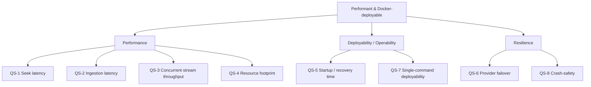

# 10. Quality Requirements

The user's brief gave two quality drivers directly: **"must run locally in Docker"** and **"as
performant as possible."** The second is not measurable as stated. This section turns both into
concrete scenarios (QS-1..QS-8) that every weak point, alternative, and optimization elsewhere in
this document is explicitly tagged against — this is the rubric the rest of the analysis is scored
on, written *before* the optimization/alternatives sections were drafted, per aim42's
Analyze-before-Improve discipline.

None of these scenarios have been measured in this codebase — there is no test suite, benchmark, or
profiler output. Each scenario below also states the experiment that would produce a real number.

## 10.1 Quality tree

## 10.2 Scenarios

| # | Scenario | Stimulus → Response | Target (proposed) | Confirming experiment |
|---|---|---|---|---|
| **QS-1** | Seek latency | User scrubs to minute 40 of a 20GB remux mid-playback → new byte range must be served | First byte of the new range delivered well under 2s | Instrument a range GET against a running instance with a real/mocked NNTP backend; measure time-to-first-byte at various seek offsets. |
| **QS-2** | Ingestion latency | Sonarr hands off a 50-segment release → file must appear correctly in the virtual filesystem, post-processed | Visible within a couple of minutes for a ~2GB episode, dominated by download time not app overhead | Time a real queue item end-to-end (add → `DavItem` visible) against a known-good provider connection; subtract raw NNTP download time to isolate app overhead. |
| **QS-3** | Concurrent stream throughput | 2–4 simultaneous direct-plays/transcodes from one container instance | All sustain their bitrate without stalls | Load-test with N concurrent range-read clients against one instance; watch for stalls/backpressure and CPU/thread saturation. |
| **QS-4** | Resource footprint | Container idles, then serves the QS-3 load | **Target TBD, pending measurement** — no baseline exists yet (§11.5, OQ-6/OQ-7); a defensible starting guess is "well under 1GB RSS idle" for a container also hosting Jellyfin/Plex/Sonarr/Radarr on the same host, but this is a placeholder, not a validated number | `docker stats` under idle and under the QS-3 load; `dotnet-counters`/Node `--prof` for hotspot attribution — run once to replace the placeholder above with a real target |
| **QS-5** | Startup / recovery | Container restarts (update, crash, host reboot) | WebDAV + queue processing available again within a short bounded time; in-flight queue items resumed, not lost | Kill the container mid-queue-item, restart, and measure time-to-ready plus whether the item resumes vs. is lost/corrupted. |
| **QS-6** | Provider failover | A configured provider goes down mid-stream | `MultiProviderNntpClient`/`ProviderCircuitBreaker` fails over to a backup provider without a client-visible stream error | Block one provider's connections at the network level mid-stream and observe whether playback continues via failover. |
| **QS-7** | Single-command deployability | A new user runs `docker run` with a config volume | Working WebDAV mount + UI with **no external service** (DB server, broker, cache) to provision | Fresh install from the published image on a clean host; count required steps/services. |
| **QS-8** | Crash-safety | Process is killed mid-download or mid-post-processing | On restart, the item is resumed or cleanly retried; the virtual filesystem never exposes a half-written/corrupt entry | `kill -9` the backend process at each pipeline stage (deobfuscation, file processing, aggregation) and inspect DB/virtual-FS state after restart. |

## 10.3 How this is used elsewhere in the document

- §5 (Building Block View) and §11 (Risks/Technical Debt) tag every weak point with the QS-# it
  threatens.
- Every entry in the alternatives brainstorms (§9, §11) states which QS it would improve and what it
  costs — including, explicitly, whether it violates QS-7 by requiring an external service or
  additional container.
- Any performance claim anywhere in this document that isn't backed by the "confirming experiment"
  column above is written as a hypothesis, not a fact.
