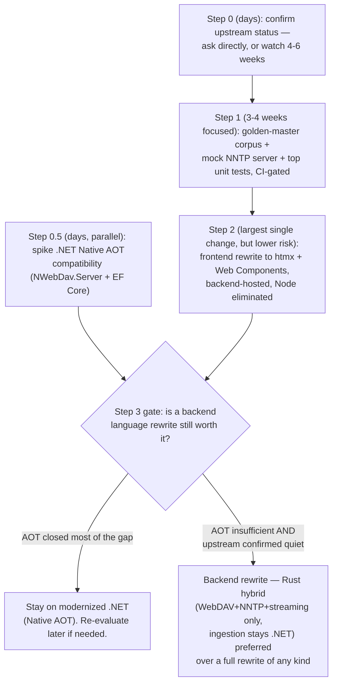

# 13. Redesign Proposals — Language, Framework, and Modularization Alternatives

## 13.0 Why this section exists

§9.3 of this document originally concluded, on the whole-system language and frontend-framework
question, "not recommended currently" — and applied that same conclusion, with the same
cost-benefit shape, to every alternative regardless of how differently sized a bet each one actually
is. That was a fair thing to push back on: a Rust backend rewrite and, say, splitting the backend
into more Visual Studio projects are not remotely the same size of decision, and treating them with
identical boilerplate hedging isn't a real analysis. Six specialist agents — two deep technical
proposals (Rust, Java+GraalVM), one broader survey (Go, Kotlin, Elixir/BEAM, C++, Zig, .NET Native
AOT), a frontend rewrite proposal (htmx + Web Components), a testing-strategy plan, and an
independent skeptic tasked with stress-testing all of it — went and did that analysis for real. This
section synthesizes their findings into a genuine, staged recommendation. §9.3 is superseded by this
section; it's left in place with a pointer rather than deleted, since the git history of arriving at
this recommendation is itself informative.

Full source material, with far more detail and nuance than fits here, is preserved in:
`docs/arc42/_research/redesign-rust-backend.md`, `redesign-java-graalvm-backend.md`,
`redesign-backend-alternatives-survey.md`, `redesign-htmx-frontend.md`,
`redesign-testing-strategy.md`, `redesign-skeptic-review.md`.

## 13.1 The load-bearing new fact: upstream has gone nearly silent

Every prior caution in this document about rewriting inherited code cited "forfeits the ability to
merge upstream's ongoing fixes" as a real, recurring cost — implicitly treating upstream
(`nzbdav-dev/nzbdav`) as a fast-moving target a rewrite would fall permanently behind. The skeptic
agent checked this directly against the live upstream repository rather than assuming it from this
fork's own commit history, and the result changes the calculus materially. Independently
re-verified for this synthesis:

```
$ gh api repos/nzbdav-dev/nzbdav/commits/main --jq '.sha[0:10], .commit.author.date'
794948be29
2026-05-27T23:07:00Z

$ gh api repos/nzbdav-dev/nzbdav --jq '{archived, pushed_at, open_issues_count}'
{"archived": false, "pushed_at": "2026-07-01T16:39:13Z", "open_issues_count": 144}
```

- **Upstream `main`'s last merged commit is dated 2026-05-27** — as of this writing (2026-07-26),
  that's two months with zero merges to `main`, on a repo with 1,121 stars and 113 forks (i.e. not
  simply unwatched).
- It is not just quiet — **it's quiet in a specific way**: substantive open PRs (Lidarr support,
  sub-path hosting, an article-health-check pipeline) have sat unmerged for one to three months, and
  several PRs — including a well-researched, independently-tested connection-leak fix — have been
  **closed without merging** (e.g. PR #478, closed 2 days after opening; PR #399, closed after
  sitting open 3 months).
- This is exactly the condition the original §9.3 already named as the trigger for revisiting its
  own conclusion: *"if the fork maintainer decides to permanently diverge from upstream... e.g.,
  upstream becomes unmaintained, a full rewrite becomes a first-class option again."* Two months of
  near-silence plus a growing backlog of stale/closed-unmerged PRs is real, dated evidence that this
  condition may already be firing — **not proof of permanent abandonment**, but a legitimate,
  falsifiable signal, not a hypothetical.

**Practical implication**: the "forfeit 415 commits' worth of future upstream fixes" cost cited
throughout §9 and §11 was sized against historical cadence. If upstream is currently merging close
to zero commits per month, a rewrite taken on today forfeits close to nothing going forward, not
"415 commits' worth." This doesn't retroactively make every ADR in §9 wrong — the *mechanism*
(diverged code can't be `git merge`d) is still true — but it substantially shrinks the *size* of that
specific cost, which was one of the two or three biggest inputs to every "not recommended" conclusion
in this document.

**This is not settled, and shouldn't be treated as settled.** The single highest-value, lowest-cost
action available before anything else in this section: **watch upstream for another 4-6 weeks, and/or
directly ask upstream (an issue or discussion) about project status.** This costs nothing, can run in
parallel with everything else in this section, and directly de-risks the single biggest number in
the whole calculus. Treat this as **Step 0** of the staged plan in §13.6.

## 13.2 Backend language alternatives

### 13.2.1 Comparative table

| Candidate | Footprint (QS-4) | Concurrency/latency fit (QS-1/QS-3) | Ecosystem maturity for this workload | Solo-maintainer risk | Verdict |
|---|---|---|---|---|---|
| **.NET Native AOT (no rewrite)** | Good — real improvement over JIT-hosted CLR | Unchanged (same async model) | Full — entire existing codebase; one open question (NWebDav.Server + EF Core AOT compatibility) | Lowest — zero rewrite | **Try this first.** Cheapest possible win; see 13.2.2 |
| **Go** | Excellent — static binary, no runtime layer | Excellent — goroutines/channels are a near-direct match for the existing read-ahead/priority design | Strong — real WebDAV package (`x/net/webdav`), workable cgo FFI, no EF-Core equivalent | Low | Best risk-adjusted full-rewrite candidate; see 13.2.5 |
| **Rust** | Excellent | Excellent | WebDAV crate exists (`dav-server`) but doesn't cover this app's bespoke seekable-streaming logic; RAR/PAR2 need hand-written parsers | Medium-high (steepest learning curve; memory-safe) | Strongest technical case, especially as a bounded hybrid; see 13.2.3 |
| **Java + GraalVM (Quarkus)** | Good | Good | Strong JVM ecosystem (jOOQ, Flyway, Commons Compress) minus real native-image reflection/FFI friction | Medium | Legitimate, more conservative alternative to Rust; see 13.2.4 |
| **Kotlin/JVM + native-image** | Same as Java+GraalVM | Very good — coroutines solve the ambient-priority problem more natively | Same as Java (shared JVM ecosystem) + modern Panama FFI | Medium (smaller pool than Java) | A nicer-ergonomics refinement of the Java proposal, not a distinct bet |
| **Elixir/Erlang (BEAM)** | Good | Mixed — excellent fault isolation, weaker raw sustained-throughput story | Poor — essentially no WebDAV ecosystem to build on | Medium-high | Conceptually the best match for this codebase's hand-rolled resilience layer, undercut by having to build WebDAV from scratch |
| **Kotlin/Native** | Good in theory | Unproven | Poor — can't reuse JVM libraries | High | Not a serious contender today |
| **C++** | Excellent in theory | Excellent in theory | Fragmented — DIY HTTP/WebDAV | Very high (manual memory management, zero tests) | Probably not — memory-safety regression is disqualifying for this project's shape |
| **Zig** | Excellent in theory | Unproven | Weak — pre-1.0, no mature WebDAV/HTTP framework | High | Watch this space, not ready today |

### 13.2.2 .NET Native AOT — try this first, it isn't a rewrite

The single highest-value item in the entire backend survey may be the one that changes nothing about
the language. `dotnet publish -p:PublishAot=true` (Native AOT, shipped since .NET 7, matured through
.NET 10) compiles the app to a single self-contained native binary — no JIT, no separate CLR runtime
layer, millisecond startup, meaningfully lower idle RSS — attacking QS-4 and QS-5 directly **without
touching a single line of the 96%-inherited business logic**. It is the only candidate in this whole
section that requires zero rewrite of working code, and the P/Invoke call into `rapidyenc` (via
`RapidYencSharp`) already works under Native AOT unchanged today.

The one real open question — and it's genuinely open, not a formality — is whether `NWebDav.Server`
and EF Core's usage in this codebase are AOT-compatible (both lean on patterns AOT restricts:
reflection, dynamic proxying). **This is answerable with a days-long spike**, not a multi-month
rewrite bet, and should be attempted *before* any full-language-rewrite proposal below is seriously
greenlit. If it works cleanly, it may independently close most of the footprint/startup gap every
other candidate in this section is trying to solve, at a small fraction of the cost.

### 13.2.3 Rust — the strongest technical case, especially as a bounded hybrid

The deep-dive proposal's most important finding is a strangler-fig cut point that avoids the exact
risk the skeptic later identified independently as the biggest one in this whole section (13.5):
**a permanent hybrid — Rust owns WebDAV protocol handling, the NNTP client stack, and stream
composition; the existing .NET process remains the sole reader/writer of SQLite and the blob store,
and keeps the Queue/ingestion pipeline entirely untouched.** This targets exactly the two quality
scenarios (QS-1 seek latency, QS-3 streaming-shouldn't-stall-behind-ingestion) where Rust's no-GC,
explicit-ownership properties actually matter, and — critically — **never touches the 96%-inherited,
heuristic-heavy, zero-test-coverage deobfuscation/RAR-reconciliation logic** that both this proposal
and the skeptic separately flag as the single riskiest thing to translate.

Key specifics:
- **yEnc decode needs no reimplementation** — Rust can FFI directly into the same native `rapidyenc`
  C library already in use, via a hand-written `-sys` crate binding (small, standard pattern).
- **WebDAV**: `dav-server` (crates.io) is real and passes standard RFC4918 compliance tests — the
  skeptic independently verified this. But this app's actual hard problem (seekable streaming over
  synthetic multi-segment/RAR/AES-wrapped content, not filesystem-backed files) isn't something any
  WebDAV crate solves for you in any language — it's bespoke either way.
- **The must-solve-first technical unknown**: the blob store's MemoryPack encoding has no Rust
  decoder. Recommended approach: don't touch the blob store from Rust at all — have the Rust service
  call back into the existing .NET process over a narrow internal API for segment/`DavItem` metadata,
  keeping MemoryPack encode/decode entirely inside the process that already understands it. This adds
  one internal network hop per file *open* (not per read), which is negligible relative to the NNTP
  round-trips already dominating the read path.
- **Effort**: hybrid Phase 1 (WebDAV + streaming + NNTP stack) is roughly 3-6 months part-time solo
  (hypothesis); a full rewrite including ingestion is 12-18+ months and is explicitly **not**
  recommended without the characterization tests from §13.4 as a hard prerequisite.
- **A legitimate "stop here" outcome**: this hybrid is proposed as a real, permanent architectural
  end state to evaluate on its own merits, not just a migration waypoint — it bounds the
  upstream-divergence cost to exactly the rewritten components (WebDAV/NNTP), while the larger,
  more upstream-active ingestion pipeline continues to receive upstream fixes normally (contingent on
  §13.1's open question about whether there still are meaningful upstream fixes coming).

### 13.2.4 Java + GraalVM — a legitimate, more conservative alternative

Quarkus (native-image-first framework) + jOOQ/Flyway (not Hibernate — this schema already
deliberately avoids ORM magic via the blob-store split, per D2/D3) + virtual threads with plain
blocking code (lower translation risk from the existing async/await decorator stack than a
Vert.x-reactive rewrite) + JNI to call `rapidyenc` directly. WebDAV is the sharpest edge: neither
Jackrabbit nor Milton is a clean fit, so the recommendation is a hand-rolled WebDAV layer on Quarkus's
Vert.x routes — mirroring how the current C# implementation already has to override its own stock
handlers for the same reason.

**The single biggest open technical risk, verified by the skeptic independently**: GraalVM
native-image's reflection/closed-world restrictions are real and well-documented (Oracle maintains a
shared reachability-metadata repository specifically because enough popular libraries need it) — this
is a genuine, non-trivial integration task for whatever ORM/SQLite-driver combination is chosen, not
a "just add a build flag" step. This compounds with a risk Rust structurally doesn't have: a
native-image binary can behave *differently* than the same code run in ordinary JVM dev-mode testing
— a two-layered risk (wrong translation + native-image-only failure mode) that doesn't exist for
Rust, which behaves identically in dev and release.

**Honest performance framing**: this is a "close the gap back to .NET parity" pitch, not "unlock new
headroom .NET couldn't reach" — the current .NET backend already starts reasonably fast and isn't a
slow interpreted runtime; Java+GraalVM's realistic ceiling here is competitive-with, not
dramatically-better-than, what .NET (especially Native AOT'd .NET, 13.2.2) already offers.

**vs. Rust**: neither language's ecosystem gap for WebDAV/archive-parsing is a decisive
differentiator (both end up hand-rolling the app's actual hard problem); Rust's structural edge is
having zero FFI/native-image-compatibility tax at all, since it's already native. Java's edges are
broader ecosystem maturity as a fallback (Commons Compress for 7z is a genuinely clean win) and a
larger OSS contributor pool.

### 13.2.5 Go — the strongest "boring" full-rewrite contender

Not one of the two languages the project owner named, but the broader survey's standout: goroutines
and channels are close to a direct match for the existing `MultiSegmentStream` read-ahead/priority
design; `golang.org/x/net/webdav` is a real, maintained WebDAV package (a stronger starting foundation
than any other candidate surveyed); cgo-to-`rapidyenc` is workable since calls are per-segment
(~700KB), not per-byte, so cgo's per-call overhead is irrelevant at this granularity; and it has the
simplest possible container footprint story of any candidate (single static binary, no runtime layer
at all — simpler even than Rust's musl-target considerations). For a solo-maintainer OSS project,
"boring, proven, huge ecosystem for exactly this class of service" may genuinely be the right answer
independent of raw performance — this is the lowest-risk *full rewrite* option surveyed, ranking above
both Rust and Java+GraalVM on the "solo-maintainer risk" axis specifically because so much of what
this codebase currently hand-rolls (semaphores, rate limiters, circuit breakers) has mature, boring,
off-the-shelf Go packages.

### 13.2.6 Others considered and set aside

- **Kotlin/JVM + native-image**: a legitimate, arguably nicer-ergonomics refinement of the Java
  proposal (coroutines are a more natural fit for this codebase's ambient-priority problem than either
  virtual threads or reactive streams) — not a fundamentally different bet, same native-image
  tradeoffs apply. **Kotlin/Native** (a different, LLVM-based target, not JVM bytecode) is a much
  higher-risk bet that loses the entire JVM ecosystem and should not be confused with the JVM-mode
  option.
- **Elixir/Erlang (BEAM)**: the most conceptually elegant match for this codebase's existing
  hand-rolled, untested connection-pool/circuit-breaker layer (BEAM gives isolated-process fault
  isolation as a runtime primitive, not application code) — undercut fatally by having essentially no
  WebDAV ecosystem to build on, meaning this candidate pays for an entire protocol server from scratch
  that every other candidate gets partially or fully for free.
- **C++**: technically capable of everything here (including the cheapest possible FFI to
  `rapidyenc`), but introducing manual memory management into a project with **zero** automated test
  coverage is a straight regression from every other candidate, .NET included — those bug classes
  don't exist in the current codebase and would be newly introduced. Clear "probably not."
- **Zig**: an interesting "safer C," but its signature strength (closer-to-metal safety) is moot here
  since the one closest-to-metal piece (yEnc decode) is already fully delegated to native code; pre-1.0
  language/ecosystem churn and no mature WebDAV/HTTP framework make it "watch this space," not ready
  for this project today.

## 13.3 Frontend: replacing React Router with htmx + Web Components

### 13.3.1 Headline recommendation: eliminate the Node process entirely

The frontend proposal's core finding is not primarily a footprint argument — it's that having the
**.NET backend render htmx fragments directly** (via ASP.NET Core Razor Pages, two lines added to the
existing `Program.cs`) deletes three weak points this analysis already flagged, rather than routing
around them:

1. The six-prefix proxy-route list hand-duplicated across `server.ts` and `server/app.ts`, which
   "no test guards" (per the original frontend research) — gone, because there's one process and one
   route table.
2. The `FRONTEND_BACKEND_API_KEY` inter-process trust boundary and its duplicated key-attachment logic
   — gone, because there's no inter-process call left to authenticate.
3. `entrypoint.sh`'s dual-process `wait_either` supervision dance (ADR-008's flagged highest-priority
   deployment gap) — gone, because there's one process to supervise; Docker's own restart policy plus
   a trivial `HEALTHCHECK` become sufficient without ever needing s6-overlay/supervisord.

**Verified, not estimated**, against the actual root `Dockerfile`: Node is installed
(`apk add --no-cache nodejs npm`) *specifically* to run this frontend, and the entire `frontend-build`
stage exists only to build it. Removing option (b) removes: that stage, that `apk add` line,
`frontend/node_modules` (246 top-level packages, 210MB, 447 total, per `package-lock.json`), and the
whole Vite/React-Router-typegen build pipeline.

### 13.3.2 Two premises corrected during this research

The proposal caught and corrected two assumptions baked into its own assignment brief, worth stating
plainly since they'd otherwise silently mislead the design:

- htmx's `ws`/SSE extensions swap **HTML fragments** into the DOM — they cannot consume this app's
  existing websocket protocol as-is, because that protocol is deliberately compact and non-HTML
  (`"qp"` is a bare percentage number, `"cxs"` is six pipe-delimited integers, `"qa"`/`"ha"` are raw
  JSON). The recommended fix is a single `<nzbdav-live-socket>` custom element that opens the
  connection, parses the existing wire format unchanged, and dispatches DOM `CustomEvent`s — not a
  backend protocol change.
- Removing React doesn't mean removing the frontend/backend split conceptually — it means the *same*
  process boundary CLAUDE.md describes today collapses to one, which is precisely what unlocks the
  three fixes in 13.3.1.

### 13.3.3 What doesn't get easier: the live-queue view

The skeptic's independent review is the important counterweight here, and it should not be
smoothed over: htmx's core model (server returns HTML, swap into DOM) is a strong, low-risk fit for
this app's document-like surfaces (settings forms, config pages, the file browser) — but the
**live queue/progress view, with multiple concurrently-updating items feeding a shared history list,
is a genuine, not-fully-solved client-side state problem**, the same category of problem React exists
to solve. The frontend proposal's own answer — a small, disciplined set of custom elements (capped at
exactly four: `<nzbdav-live-socket>`, `<nzbdav-uploader>` for per-file drag-and-drop upload progress,
`<nzbdav-settings-form>` for cross-tab dirty-tracking, and an optional connection-gauge widget) — is a
reasonable, concretely-scoped answer, but it is genuinely new client-side code with no framework
discipline behind it, in a codebase with zero frontend tests today. The mitigation the proposal
commits to: a hard cap on custom-element count, DOM-event-only communication between them (never
shared module state), and treating these four elements as the natural first place to add frontend
tests, since they're new files rather than legacy ones to retrofit.

### 13.3.4 Migration plan, in brief

Incremental, not big-bang: the existing Express proxy already has the right shape to route one path
prefix at a time to the new backend-rendered pages while everything else still hits React Router.
Recommended order: `login`/`explore` first (already effectively static/no-state — the easiest and
lowest-risk starting point, and note `explore`'s file links were *already* plain `<a href>` tags
bypassing React entirely per the original ADR-007 finding), then `health`, then `queue`
(live-socket + row patching), then `settings` last (the hardest — cross-tab dirty tracking). Full
route-by-route mapping is in `docs/arc42/_research/redesign-htmx-frontend.md` §2.

## 13.4 Testing strategy: the prerequisite for any of this

Every proposal above runs into the same wall: **there is no test suite to prove a rewrite preserves
behavior.** The testing-strategy proposal's answer is a **golden-master / characterization-test
approach**: build a synthetic (not real-copyrighted-release-shaped, to avoid any legal ambiguity)
corpus of NZBs covering every container/processing path (plain files, RAR multi-volume,
password-protected, 7z store-mode multipart, raw multipart-mkv, obfuscated releases, missing
articles, sample/blocklist filtering), run each through the *current* .NET pipeline, and record the
resulting `DavItem` tree shape plus byte-for-byte streamed output at several byte ranges — critically
including at least one non-zero, non-aligned seek offset, since that's the single most fragile code
path in the whole system. That recorded corpus becomes the acceptance bar any Rust/Java/Go/htmx
rewrite must reproduce exactly. A small mock NNTP server (a modest weekend build — the protocol
subset used here is simple line-based text) is the one piece of shared infrastructure this needs, and
it separately unlocks unit/stress-testing the Usenet client stack's riskiest, currently-untested code
(`ConnectionPool`/`ConnectionLock`, explicitly ChatGPT-authored with zero coverage today).

Ranked, cheapest-first unit-test targets (all pure in-memory logic, no network needed): RAR/7z
part-number reconciliation, PAR2 filename-reconciliation priority/tolerance logic, and the
interpolation-search seek algorithm — each S-effort, each closing a "silently produces wrong bytes,
no crash" risk class. **Wire `npm run typecheck` into CI immediately, independent of everything
else** (already an existing backlog item, P2-8 — this reprioritizes it to "do this week").

**Estimated cost**: roughly 6-8 weeks of solo part-time effort (3-4 weeks focused) to reach "golden
master + top unit tests, CI-gated" — small relative to the multi-month scope of any full backend
rewrite, which is exactly the point: this is a cheap prerequisite, not a comparable-scope alternative
project.

## 13.5 The risk asymmetry that should drive sequencing

This is the skeptic's single most important structural insight, and it reframes "which rewrite is
bigger" into the more useful question "which rewrite's bugs are more dangerous":

**A backend bug in the deobfuscation/RAR-reconciliation heuristics is silent and destructive** — it
doesn't crash or throw a visible error; it silently produces a wrong-but-plausible filename, a
misordered RAR part, or a wrong byte range that only surfaces as a garbled video or a mis-imported
episode, reported (if at all) by a user against a release the maintainer has never seen. **A frontend
bug is visible and recoverable** — a broken page renders wrong or a form doesn't submit, and no
user's Usenet download or media library is put at risk by it. This asymmetry — not raw lines-of-code
count — is the real reason a frontend rewrite is structurally lower-risk than a backend rewrite, and
it's reinforced by an independent fact from §9: this fork's own commits have **never touched**
`server.ts`/`app.ts`/`websocket.server.ts`/`auth-middleware.server.ts`/`routes.ts` (D33) — meaning
there's no fork-specific frontend logic that would need re-porting, unlike the backend, where
fork-specific features (prefetch caching, bandwidth throttling, usage stats) are threaded through
inherited files and would need re-integration into any rewritten backend regardless of which language
is chosen.

## 13.6 Synthesized recommendation: a staged plan with go/no-go gates

This is the orchestrating recommendation, weighing all six agents' findings against each other —
not any single agent's own conclusion in isolation.



1. **Step 0 (days, do immediately)**: confirm upstream's real status — post an issue/discussion
   asking directly, and/or simply watch for 4-6 weeks. This changes the size of the single biggest
   number in this whole document and costs nothing to do in parallel with everything else.
2. **Step 0.5 (days, parallel with Step 0)**: spike .NET Native AOT compatibility (13.2.2). If
   `NWebDav.Server` and EF Core's usage in this codebase turn out AOT-compatible (or fixable with
   contained effort), this alone may close most of the footprint/startup gap every other proposal in
   this section is trying to solve, at a tiny fraction of the cost of any rewrite — and if the spike
   fails, that failure is itself useful evidence (it means this code is going to need touching in a
   backend rewrite anyway, strengthening the case for Step 3 rather than weakening it).
3. **Step 1 (3-4 weeks focused, do regardless of what else happens)**: build the golden-master
   characterization-test corpus and the highest-priority unit tests (§13.4). No backend rewrite, in
   any language, should start before this exists — it is the only thing that turns "did the rewrite
   preserve behavior" from a matter of faith into a matter of verification, and it retains full value
   even if no rewrite is ever attempted.
4. **Step 2 (the largest single change in this whole plan, but the structurally lower-risk one)**:
   the frontend rewrite to htmx + Web Components, backend-hosted, eliminating the Node process
   (§13.3). Start with the document-like surfaces (login, explore, settings) and treat the live-queue
   view as a deliberately separate, harder sub-problem, not a uniform swap. This is recommended
   *before* any backend language decision specifically because of the risk asymmetry in §13.5: it
   can't touch the 96%-inherited domain logic at all, and its own bugs are visible and recoverable
   rather than silent and destructive.
5. **Step 3 (the real, biggest bet — gated behind 0, 0.5, and 1, not attempted first)**: only pursue
   a backend language rewrite if Step 0.5's Native AOT spike didn't close the gap on its own, and
   ideally with Step 0 having confirmed upstream divergence is already the practical reality. If
   pursued: **prefer the Rust strangler-fig hybrid (13.2.3) over a full rewrite in any language** —
   it targets exactly the quality scenarios where a language change has real technical grounds
   (seek latency, no-GC reliability wins), and it structurally avoids the highest-risk part of the
   whole system (ingestion/deobfuscation) by design, not just by discipline. Go (13.2.5) is the
   strongest full-rewrite alternative if a hybrid is rejected in favor of fully leaving the .NET
   ecosystem. Java+GraalVM (13.2.4) is a legitimate, more conservative choice if ecosystem breadth
   and a larger contributor pool matter more than avoiding native-image's compatibility tax. Between
   Rust and Java specifically, neither agent's research found a decisive ecosystem-maturity argument
   either way — this is legitimately the maintainer's own call, informed by their own language
   familiarity (unverified in this analysis either direction) more than by crate/library
   availability.

**What this plan deliberately avoids**: running the frontend and backend rewrites simultaneously,
which reintroduces the classic stalled-rewrite failure mode in its solo-maintainer-specific form —
one person, two large simultaneous unfinished efforts, with the currently-working version's own
maintenance (dependency CVEs, user bug reports, Docker base-image EOL) starved of attention regardless
of upstream's pace. At most one large rewrite in flight at a time; ship Step 2 as a real, working
improvement before Step 3 begins.

## 13.7 What this section revises vs. leaves standing

| Prior conclusion | Status after this section |
|---|---|
| §9.3: whole-system Rust/Go/Node rewrite "not recommended currently" | **Revised.** Superseded by the staged plan in 13.6 — no longer an outright rejection, but explicitly gated behind Steps 0/0.5/1, with a concrete preferred shape (Rust hybrid) if pursued. |
| §9.3: frontend framework rewrite recommended only after an `ssr:false` measurement | **Revised.** The htmx+Web-Components proposal is now recommended as Step 2, ahead of any backend decision — the decisive question turned out to be design-fit (does this UI's live-queue state suit htmx's model — partially, per 13.3.3), not the SSR-off footprint measurement, which remains worth doing but is no longer the gating experiment. |
| §11.4: "whole-system rewrite... revisit only as a deliberate strategic fork-divergence decision" | **Upheld, and sharpened**: §13.1 provides the first concrete, dated evidence that this precondition may already be firing. |
| "Zero test coverage" as a reason for caution | **Upheld as fact, revised as an automatic blocker.** It's real and it's the single most legitimate reason to sequence any rewrite behind §13.4's testing investment — but it's a solvable prerequisite (weeks), not a permanent veto. |
| Yenc decode already native/SIMD, "biggest classic rewrite-for-speed win already banked" | **Upheld unanimously** by every agent that touched this question. Any pitch for a language rewrite based on "faster yEnc" is wrong; the real arguments are container footprint, structural reliability (retiring the `ConnectionPool`/`CancellationTokenContext` fragility), and — for Rust specifically — no-GC latency-tail behavior. |
| Modularization ("split into more projects") | **Unchanged from §9.3.** No agent in this round found reason to revisit this — it remains not worth pursuing at this deployment scale, independent of any language decision. |
