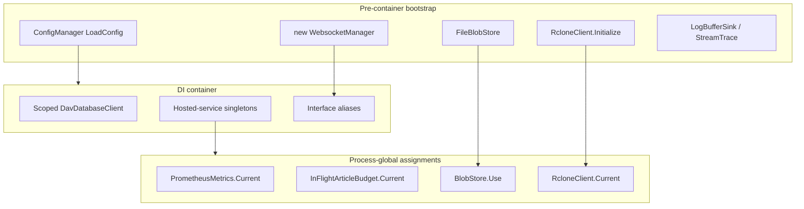

# DI topology and injected contracts

Status: accepted
Date: 2026-08-20

## Context

The backend is a single process. Many objects are constructed before the DI
container, registered as singletons, or accessed through static facades.
[Issue #247](https://github.com/infinidysk/infinidysk/issues/247) covers
`IDbContextFactory` for hosted services. This ADR records the rest of the
topology and the first five contracts. DI does not by itself enable horizontal
scaling: blobs, metrics, Warden/cache files, and worker ownership stay
process-local.

PostgreSQL is already supported for the main database. The historical
SQLite-only claim on #857 is stale.

## Current topology

| Kind | Examples | Classification |
|------|----------|----------------|
| Immutable process configuration | env overlay, thread-pool limits | Keep as bootstrap |
| Mutable persisted state | `ConfigManager` | `IConfigReader` / `IConfigUpdater` / `IConfigChangeSource` |
| Resource owner | `QueueManager`, `UsenetStreamingClient`, `FileBlobStore` | Inject; queue workers stay internal |
| Cache | blob metadata cache, segment cache | Owned by the resource singleton |
| Telemetry facade | `PrometheusMetrics.Current`, stream trace | Separate later slice |
| Test seam only | `RcloneClient.TestHandler`, queue context overrides | Keep explicit |

## Decision

Extract contracts for the five highest-coupling seams without duplicating #247:

1. Config — split read / update / change-source. Typed getters remain on
   `ConfigManager` until grouped by domain. Subscribers dispose via
   `IConfigChangeSource.Subscribe`.
2. Blob storage — `IBlobStore` / `FileBlobStore`. Static `BlobStore` forwards
   to the DI singleton after `BlobStore.Use`.
3. rclone — `IRcloneClient`. `RcloneClient` is an instance that unsubscribes
   on dispose. `RcloneClient.Current` is the remaining static bridge for
   `DavDatabaseContext.RcloneVfsForget`.
4. Queue — `IQueueCoordinator` for controller/health operations.
   `QueueManager` keeps worker ownership.
5. WebSocket — `IWebsocketPublisher` for publish-only consumers.
   Session management stays on `WebsocketManager`.

Do not extract interfaces solely to raise interface count. Process-global
telemetry (`PrometheusMetrics.Current`, in-flight budget, repair sinks)
stays a later slice.

## Consequences

Call sites can take narrow contracts. Remaining static bridges are documented
and must not gain new consumers. Completing #247 and migrating leftover
`new DavDatabaseContext()` helpers is out of this ADR. Two independent test
hosts can still share `RcloneClient.Current` / `BlobStore` until those
bridges are removed.
