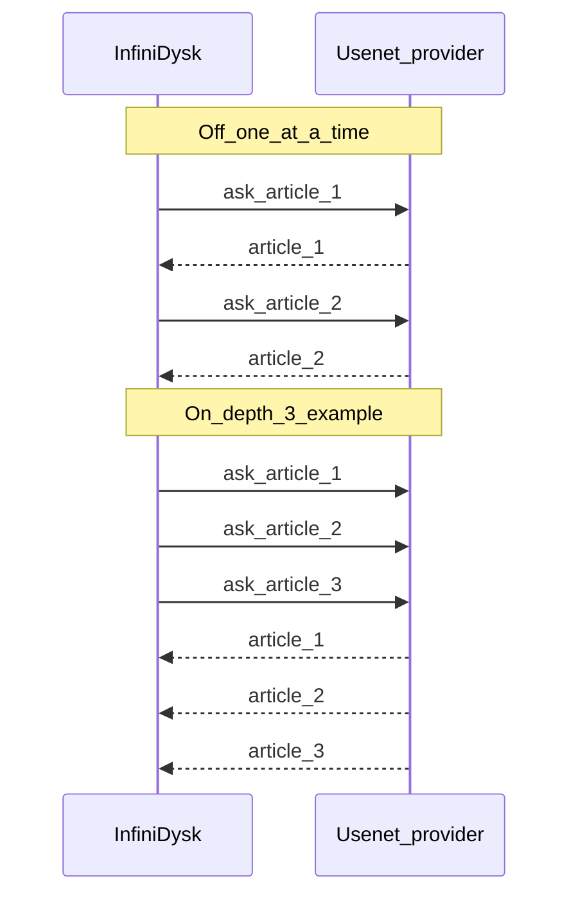

# NNTP pipelining

Pipelining keeps a Usenet connection busy by asking for the next articles before the previous ones finish arriving. **Depth** is how many asks stay outstanding on that connection (default `8` for queue imports).

Responses still arrive in order; depth is the queue of outstanding asks.

## Three controls

| Setting | Location | Default | Controls |
|---------|----------|---------|----------|
| `usenet.queue-pipelining.enabled` | Settings → Usenet | off | Queue first-segment fetch and provider benchmark batches |
| `usenet.pipelined-body-requests` | Settings → Streaming | on | Enable WebDAV streaming BODY batches |
| `usenet.streaming-body-batch-width` | Settings → Streaming | `4` | Maximum articles per streaming BODY batch (1–8) |

Legacy keys `usenet.pipelining.enabled` and `usenet.pipelining.depth` remain honored as fallbacks (including via `NZBDAV_CONFIG__USENET__PIPELINING__*` env vars). Upgrades copy their SQLite values into the new queue keys; rename env vars to `NZBDAV_CONFIG__USENET__QUEUE_PIPELINING__*` when possible.

## What queue pipelining speeds up

| Path | Without | With |
|------|---------|------|
| Queue first-segment fetch (0→50%) | one BODY per file across connections | depth-sized batches on a connection |
| Provider benchmark | one BODY per article | depth-sized batches |

Health/import existence checks use concurrent `STAT` and are unaffected. **Queue pipelining does not change WebDAV playback** — that path uses the streaming toggles above.

## How connections, batch width, and memory interact

During WebDAV playback with batched BODY requests enabled:

- Connections engaged per stream ≈ outstanding segment window ÷ batch width.
- At stream construction, InfiniDysk sizes the segment task window and prefetch byte ceiling from the configured batch width and article buffer. Those ceilings stay fixed for the life of the stream; adaptive narrowing only shrinks future batch sizes, not the retained window.
- Decoded bytes retained across all streams are capped host-wide by `usenet.in-flight-article-budget-mb` (25% of the detected managed-heap ceiling by default, clamped to 64–8192 MiB). One stream with a wide batch width can consume most of that budget and starve other concurrent viewers.

Provider behavior varies: some throttle per connection (wider batches can help), others per account (more connections / narrower batches). If Auto-tune reports queue pipelining is unsafe for a provider, treat wide streaming batch widths cautiously too — both use the same NNTP pipelining mechanism.

## Enabling

1. Prefer **Auto-tune** on a provider before enabling queue pipelining.
2. **Settings → Usenet → Queue pipelining** + queue depth (1–64, default 8). Per-provider depth overrides optional.
3. Streaming: **Batched article downloads** and optional **Streaming batch width** on the Streaming tab.

## Limitations

- Pipelined batches use the same per-segment failover as `DecodedBodiesAsync`.
- Per-queue-item article cache can bypass pipelined queue paths when caching is enabled.

[Usenet](../configuration/usenet.md) · [Streaming](../configuration/streaming.md)
