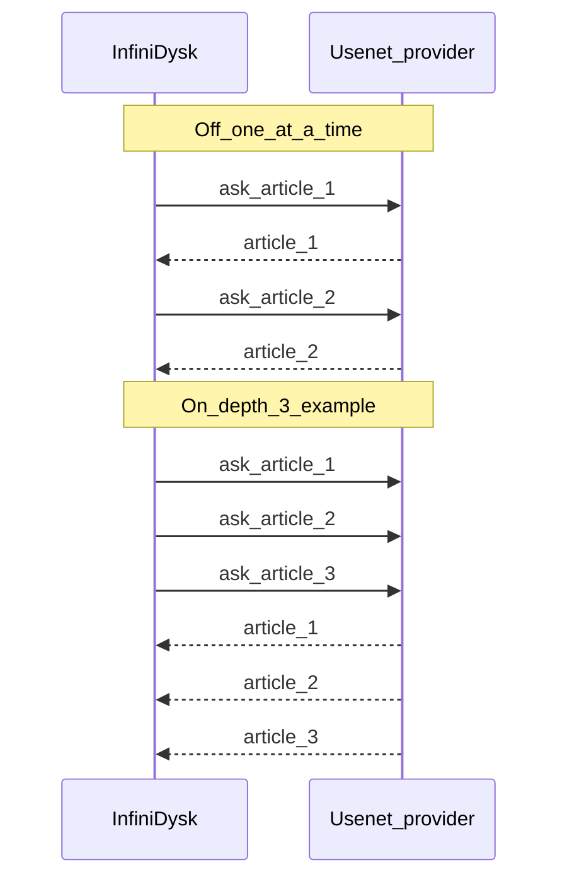

# NNTP pipelining

Pipelining keeps a Usenet connection busy by asking for the next articles before the previous ones finish arriving. **Depth** is how many asks stay outstanding on that connection (default `8`).

Responses still arrive in order; depth is the queue of outstanding asks.

## Two toggles

| Setting | Location | Default | Controls |
|---------|----------|---------|----------|
| `usenet.pipelining.enabled` | Settings → Usenet | off | Queue first-segment fetch and provider benchmark batches |
| `usenet.pipelined-body-requests` | Settings → WebDAV | on | WebDAV streaming read-ahead batches |

## What queue pipelining speeds up

| Path | Without | With |
|------|---------|------|
| Queue first-segment fetch (0→50%) | one BODY per file across connections | depth-sized batches on a connection |
| Provider benchmark | one BODY per article | depth-sized batches |

Health/import existence checks use concurrent `STAT` and are unaffected.

## Enabling

1. Prefer **Auto-tune** on a provider before enabling queue pipelining.
2. **Settings → Usenet → Enable NNTP pipelining** + pipeline depth (1–64, default 8). Per-provider depth overrides optional.
3. WebDAV: **Pipelined article downloads** on the WebDAV tab.

## Limitations

- Pipelined batches use the same per-segment failover as `DecodedBodiesAsync`.
- Per-queue-item article cache can bypass pipelined queue paths when caching is enabled.

[Usenet](../configuration/usenet.md) · [WebDAV](../configuration/webdav.md)
