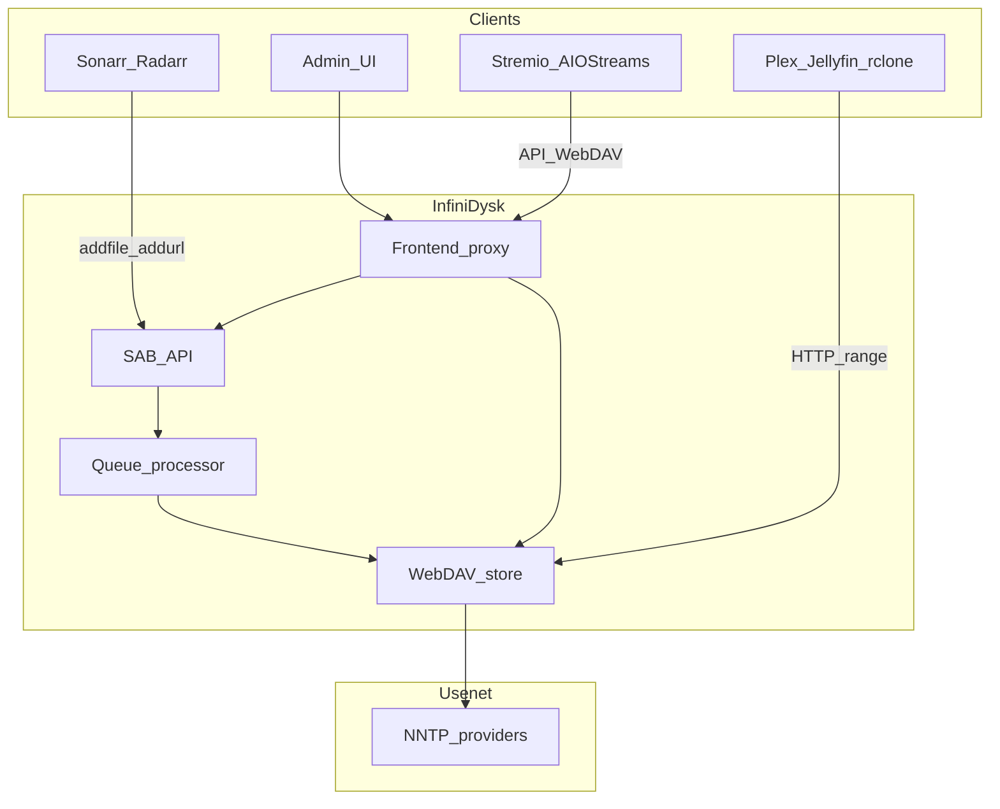

# Architecture

InfiniDysk sits between download clients / search and Usenet providers, exposing a virtual filesystem and SAB-compatible API.

## Two common flows

### Automation (*Arr + media server)

1. Radarr/Sonarr sends an NZB to InfiniDysk as a SABnzbd download client.
2. InfiniDysk mounts the release on WebDAV without downloading the full file.
3. Import artifact:
   - **Symlinks** — entries under `completed-symlinks`; rclone turns them into filesystem links into `.ids`.
   - **STRM** — small `.strm` files with authenticated streaming URLs.
4. *Arr imports into the library; the media server reads through the link/URL → InfiniDysk → Usenet.

### On-demand (Stremio)

There are two Stremio paths:

**Direct Search Profile preset** [since 1.3.0](https://github.com/infinidysk/infinidysk/releases/tag/v1.3.0){ .nzbdav-since }

1. InfiniDysk searches the profile's Newznab indexers and returns playable stream objects.
2. AIOStreams or Stremio lists those streams. The dedicated InfiniDysk preset can report the final order back to `/failover_order`.
3. Playback hits `/play/{token}.mkv`, which resolves/queues the NZB and redirects to `/view`.

**AIOStreams-managed search**

1. AIOStreams finds a release via its own Newznab addons.
2. The NZB is mounted through InfiniDysk's service/API.
3. Playback URL (often proxied by AIOStreams) streams from WebDAV.

## Processes and ports

| Process | Default | Role |
|---------|---------|------|
| Frontend | `:3000` | Admin UI, auth, proxy for WebDAV + `/api` + `/ws` |
| Backend | `:8080` (internal) | WebDAV, queue, SAB API, SQLite under `CONFIG_PATH` |

Backend services such as rclone should connect directly to WebDAV on port `8080`
whenever the backend is reachable. The frontend WebDAV proxy is a fallback for
clients without network access to the backend and adds avoidable streaming overhead.

Persistent state lives under `/config` (DB, settings, blobs, backups).

## Related

[Import strategies](import-strategies.md) · [Features overview](../features/index.md) · [Environment variables](../configuration/environment-variables.md) · [Code boundaries](../decisions/0001-code-boundaries.md)
